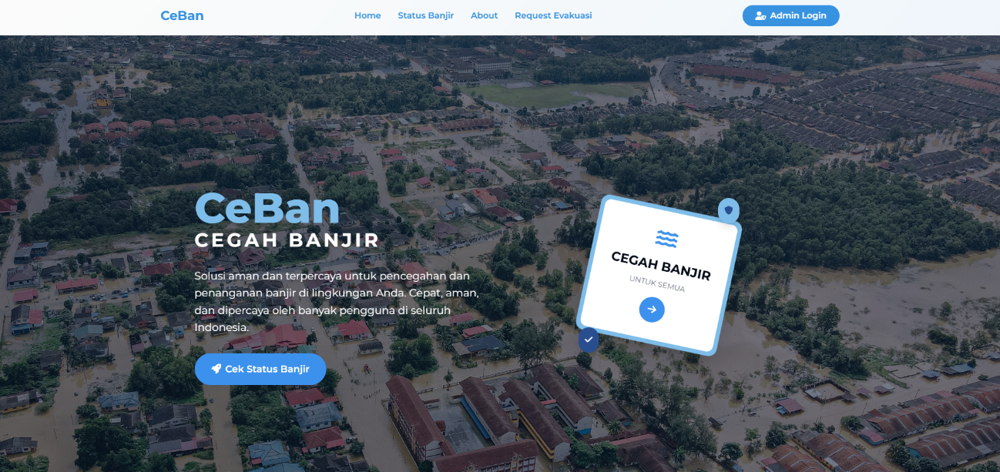

# Cegah Banjir (CeBan)
<p align="center">
  
</p>
[](https://opensource.org/licenses/MIT)
[](https://php.net/)
[](https://laravel.com/)
[](https://getbootstrap.com/)

A web-based platform designed to provide real-time information and emergency services related to flood events. CeBan integrates data from various official sources to enhance community preparedness and accelerate response to flood disasters.

---

### Table of Contents

-   Project Description
-   Key Features
-   Actors / User Roles
-   Technology Stack
-   System Architecture
-   Getting Started
-   Project Structure
-   Usage
-   Contributing
-   License
-   Development Team

---

### Project Description

Flooding is a serious and recurring problem in many major cities. The Cegah Banjir (CeBan) application was developed to address the challenges of high rainfall, suboptimal drainage systems, and the lack of fast, accurate information for the public.

This project aims to be an integrated solution that provides:
1.  **Centralized Real-Time Information**: A single platform for the public and authorities to access real-time data on water levels, water pump status, and weather conditions.
2.  **Effective Early Warning System**: An automated system to inform residents of potential flood risks in their areas.
3.  **Streamlined Emergency Response**: A feature for the public to request emergency evacuation, which is directly forwarded to response teams for faster action.

The application integrates directly with data sources like the *Dinas Sumber Daya Air dan Bina Marga (DSDABM)* to ensure the information provided is timely and reliable.

### Key Features

-   **Real-time Data Monitoring**: View up-to-date information on water pump locations and operational status on an interactive map.
-   **Flood Status Dashboard**: A comprehensive table view of flood status across different Watershed Areas (Daerah Aliran Sungai - DAS), including water level, weather, and an overall status (Normal, Siaga, Waspada).
-   **Emergency Evacuation Requests**: A simple form for users in distress to submit an emergency evacuation request with their location, contact details, and number of people.
-   **Admin Dashboard**: A secure area for administrators to monitor incoming data, manage system users, and follow up on evacuation requests.
-   **Automated Early Warnings**: The system is designed to trigger notifications when flood status in an area changes, enhancing community preparedness.
-   **Responsive & Modern UI**: Built with Bootstrap for a clean, accessible, and responsive user experience on all devices.
-   **Secure Authentication**: The admin area is protected by Laravel's built-in authentication system.

### Actors / User Roles

The system is designed for three main actors:

1.  **User (General Public)**: Can access all public information, including the water pump map and flood status dashboard. Can also submit emergency evacuation requests.
2.  **Admin**: Manages the application's data, monitors real-time information on the dashboard, manages user accounts, and forwards evacuation requests to the appropriate response team (BPBD).
3.  **External System (e.g., DSDABM)**: An external government agency system that provides the core real-time data (water level, weather, pump status) to the CeBan application.

### Technology Stack

The application is built with a modern and robust technology stack:

-   **Backend**: PHP >= 8.1, Laravel Framework
-   **Frontend**: HTML5, CSS3, JavaScript, Bootstrap 5
-   **Database**: Firebase Realtime Database (for primary monitoring data), SQLite/MySQL (for authentication and local data)
-   **Package Manager**: Composer (for PHP)
-   **APIs & Services**: Google Maps JavaScript API
-   **Development Server**: PHP Built-in Development Server
-   **Version Control**: Git

### System Architecture

The CeBan system uses a NoSQL Firebase Realtime Database to efficiently handle and store time-series data from external sensors. The data is organized hierarchically by date, time, and watershed area (DAS) to allow for fast real-time and historical queries.

**Data Flow:**
1.  An **External System** (from DSDABM) periodically sends sensor data (water level, weather) to a dedicated API endpoint in the CeBan Laravel application.
2.  The Laravel backend **validates** this data and stores it in the **Firebase Realtime Database**.
3.  The **Frontend** (Blade templates) fetches this data from Firebase to display on public pages like the status dashboard and pump map.
4.  When a **User** submits an evacuation request, the data is saved to the local database, and a notification is sent to the **Admin**.
5.  The **Admin** views the request on their dashboard and forwards the details to the relevant emergency response team (BPBD).

### Getting Started

Follow these instructions to get a local copy of the project up and running for development and testing purposes.

**Prerequisites:**
-   PHP >= 8.1
-   Composer
-   Node.js & NPM
-   A database server (MySQL, or use SQLite)
-   A Firebase project with Realtime Database enabled.

**Installation Steps:**

1.  **Clone the repository:**
    ````sh
    git clone [https://github.com/moetzi/ceban-laravel.git](https://github.com/moetzi/ceban-laravel.git)
    cd ceban-laravel
    ````

2.  **Install PHP dependencies:**
    ````sh
    composer install
    ````

3.  **Install frontend dependencies:**
    ````sh
    npm install
    ````

4.  **Set up your environment file:**
    -   Copy the example environment file:
        ````sh
        cp .env.example .env
        ````
    -   Generate a new application key:
        ````sh
        php artisan key:generate
        ````

5.  **Configure your `.env` file:**
    -   Set up your database connection (e.g., for MySQL or SQLite):
        ````env
        DB_CONNECTION=mysql
        DB_HOST=127.0.0.1
        DB_PORT=3306
        DB_DATABASE=ceban
        DB_USERNAME=root
        DB_PASSWORD=
        ````
    -   Add your Firebase Project credentials. You will need to create a service account in your Firebase project and download the JSON key file.
        ````env
        FIREBASE_PROJECT_ID=your-project-id
        FIREBASE_DATABASE_URL=[https://your-project-default-rtdb.firebaseio.com/](https://your-project-default-rtdb.firebaseio.com/)
        FIREBASE_CREDENTIALS=/path/to/your/firebase_credentials.json
        ````

6.  **Run database migrations:**
    ````sh
    php artisan migrate
    ````
    *(Optional) Seed the database with initial data if seeders are available:*
    ````sh
    php artisan db:seed
    ````

7.  **Compile frontend assets:**
    ````sh
    npm run dev
    ````

8.  **Run the development server:**
    ````sh
    php artisan serve
    ````
    The application will be available at `http://127.0.0.1:8000`.

### Project Structure

The repository follows a standard Laravel project structure.

`````

app/                \# Core application logic (Controllers, Models, Services)
bootstrap/          \# Application bootstrap scripts
config/             \# Configuration files
database/
├── migrations/    \# Database schema migrations
└── seeders/       \# Database seeders
public/             \# Publicly accessible assets (CSS, JS, images)
resources/
├── css/           \# Source CSS files
├── js/            \# Source JavaScript files
└── views/         \# Blade templates for the UI
routes/             \# Route definitions (web.php, console.php)
storage/            \# Compiled templates, session files, logs

```

### Usage

**Public User:**
-   Navigate to the homepage to see an overview.
-   Click on **"Cek Data Pompa Air"** to view the interactive map of water pumps.
-   Visit the **"Status Banjir"** page to see a detailed table of current conditions in different areas.
-   In an emergency, fill out and submit the form on the **"Request Evakuasi"** page.

**Admin User:**
-   Log in via the admin login page.
-   The **Dashboard** provides a high-level overview of the system, including water level graphs and evacuation statistics.
-   Navigate to **"Status DAS"** to monitor incoming data in real-time.
-   Use **"Kelola Pengguna"** to add, edit, or remove user accounts from the system.
-   Process incoming evacuation requests from the relevant section in the dashboard.

### Contributing

Contributions are what make the open-source community such an amazing place to learn, inspire, and create. Any contributions you make are **greatly appreciated**.

If you have a suggestion that would make this better, please fork the repo and create a pull request. You can also simply open an issue with the tag "enhancement".

1.  Fork the Project
2.  Create your Feature Branch (`git checkout -b feature/AmazingFeature`)
3.  Commit your Changes (`git commit -m 'Add some AmazingFeature'`)
4.  Push to the Branch (`git push origin feature/AmazingFeature`)
5.  Open a Pull Request

### License

Distributed under the MIT License. See `LICENSE.txt` for more information.

---

### Development Team

This project was developed by PPPL A Kelompok 1:

-   Achmad Hussein Azzaydi (5026211134)
-   Dia Naufal Abiyyu Tsaqif (5026221042)
-   Mutiara Noor Fauzia (5026221045)
-   Putri Salsabilla Insani (5026221062)
-   Awwaliyah Aliyah (5026221149)
-   Ryan Adi Putra Pratama (5026221161)
-   Muhammad Hasan Kamal (5026221173)
-   Devy Relliani Saffiyah (5026221189)
-   Muhammad Ariq Alwin (5026221177)
